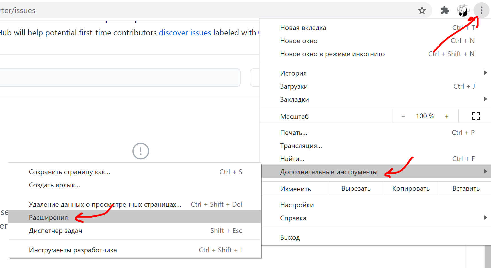
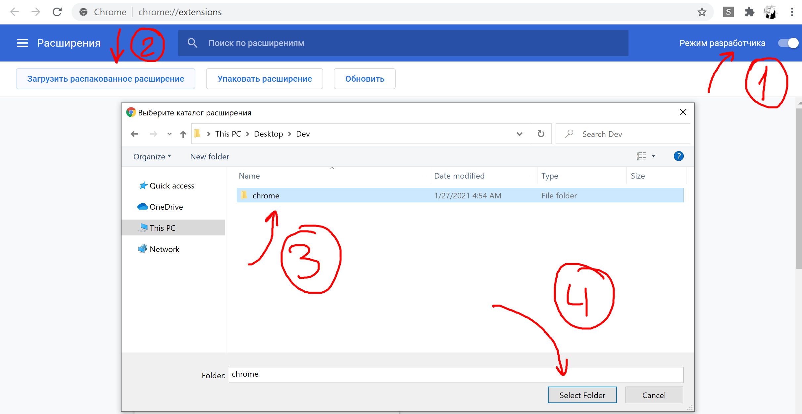
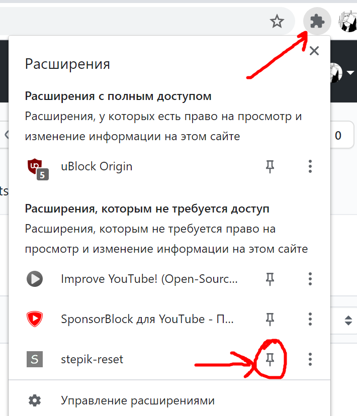

# stepik-restarter
# НЕ АКТУАЛЬНО
Расширение, позволяющее сбрасывать прогресс по заданиям на stepik.org

Если включить ползунок, все задания в которых уже дан ответ будут сбрасываться (прошлое решение можно найти в истории на сайте), однако если вы его сделаете сами и не будете перезагружать страницу, то оно не будет сбрасываться. Т.е. внутри одного урока можно спокойно переходить между решенными заданиями без потери прогресса до первой перезагрузки страницы.

Зачем?

Официальной функции для сброса прогресса не предусмотрено, а вот иногда хочется пройти курс еще раз, но ответы на задания мозолят глаза и не дают подумать самому.

Установка 

